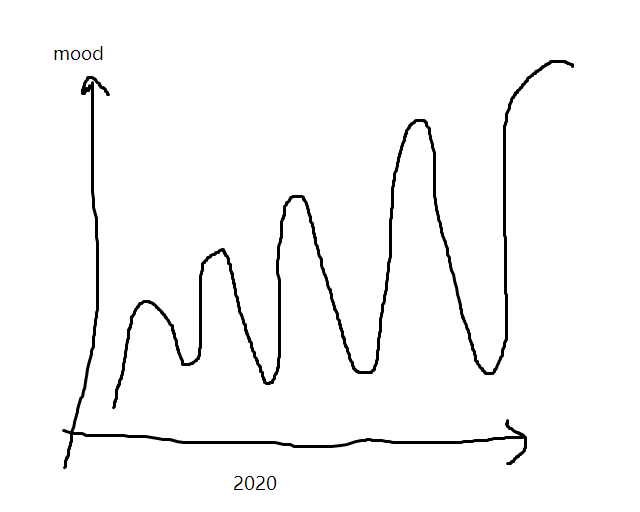

# 2020 06 27 半年报

上半年要过完了，只感觉到时间飞逝而无所得，间歇性陷入抑郁和狂躁情绪之中，想逃离想退学，又间歇性顿悟好起来，总的来说，虽然如此曲折，每次坠落更深但都会对自己、他人、世界的认知反思上升一个Level，心理咨询师说，对内归因的人面对错误和偏差会格外敏感，格外痛苦，但这就是完善自我的过程，能够从中学到更多东西。的确如此，它让我看到了我身上过去被压抑在理性、思考、判断之下的自我，一个人性化的自我，对这件事的认知渐渐从一开始的仇恨负面、庸俗情节、爱的本质，到性格与依恋关系，亲密关系的保持和危机处理问题，再到向内探求自我，找到深层原因，最后到越过上帝，该隐之印慢慢浮现，走到我自己必将要走的路上。

恋情虽然时常直接导致我的抑郁和狂躁，但是我实在不是一个情感丰富的人，真深入分析长期抑郁和痛苦的原因，失恋至多是那根引线。性别认同才是根源性的50%，高中少年班被碾压的经历加上高中同学和ex的peer pressure可能有30%，糟糕的家庭关系和父母婚姻占到20%。

生活中很多事可以用冰山模型解释，大家都看得见所以喜欢纠结于看见的冰顶和直接原因，眼光深入的人会看到水下冰层和浮冰，但引起冰山相撞的往往是十倍百倍于表面的根基，漫长岁月里形成的根基不那么容易被发现，也不那么容易改变。

这三个炸弹就一直埋在那里，交替在我生活中变化着，许多外在的东西掩盖着矛盾，但从未真正解决掉。过年回家时家里糟糕关系、北京的第一次失败引爆了后两者，让我对于当时女朋友无条件的包容与热烈（并看起来）真挚的爱没有任何抵抗力，一反常态丧失理智地陷入情感和性。尽管我自己当时根本无从察觉究竟为什么爱上对方，我一直以为是灵魂伴侣的默契，但仔细想想生命里的其他人未必没有出现过灵魂伴侣的可能，选择却大相径庭。那两年曾一点点让我完全放松下来、不同程度地解决掉三个炸弹的恋情，突然之间的撤离一下把这些东西引爆，看似平静的生活瞬间崩塌，又开始借着难过沉溺自己。可我自己一直很清楚生命中的人到来和离去的必然，也并不像是为一次失恋难过的人。因为问题都在恋爱之外，而且短期都不能解决，这才是让我如此绝望的冰山之下。

也不能说毫无成果。2-3月份结了一篇 2nd 小论文工作在投，对前半年的工作有个交代，初步掌握了DRL代码技巧和工程trick，但很快有掉进坑里半个月睡觉和眼泪虚度时间，刷国外疫情新闻。4月份前半个月一直狂躁不务正业，学习心理和理财，刷了小半个月MIT 系统结构公开课，开始在基金和黄金建仓。令人懊悔的黄金抛飞，导致后期股市费劲分析财报和板块的收益率也不过与最开始持有黄金相当。4月份下半个月有认真工作，发现前一个工作三个可以做的拓展点，B代码部分进入调参阶段。原本预计5月份调参和论文快刀斩乱麻，实际上5月回到学校后隔离和心态再度崩盘，日日不敢回到寝室唤起回忆，论文也就此停滞。整个5-6月除了几天复习考试、股市研究、其余基本在实验室齿轮空转，另一项搁置项目C代码调试了两个月毫无进展。

综上来看，剧烈波动的心理状态导致了极不合理的工作量分配，一段时间一天干3天的活，manic time 记录周工作时间高达70h，一段时间3天不干活，缺少稳定输出，还导致了一次处在躁郁期的考试崩盘，这是前半年最大的遗憾。下半年务必避开这一点。

学业以外的部分，股票近半年收益率大于基金，黄金出仓时间完全失败，整体10%左右，锻炼上没有坚持好，三天打鱼两天晒网，完全不像有腹肌的样子，但是手臂和肩部强壮了很多。近半年几乎不敢听有歌词的歌，但是解锁了一些钢琴曲纯音乐的品鉴力，避开读诗歌、历史和文学，越来越紧迫地想要知道世界运行的规律，愈发功利化。对自己的未来思考好像并没有更加清晰，但是可以确定的是知道自己想要什么，但还没有虽千万人吾往矣的勇气，仍然会追逐、质疑、摇摆，不够坚定不够平静，开始明白只要是人就会受强烈情感波动，无需为此感到羞耻，开始恢复理性分析自我。

每一次掉进陷阱之中，都是和老板meeting把我捞起来，前几天也是这样。不得不说，不知道是不是因为本科相同、生长环境相似的原因，在老板身上能够看到我理想中要成为的自我，一个具备好的视野和大局观、以专注思考为己任、逻辑严密、疏离人群、价值观稳定正直、以聪明而非刻苦的方式做事的INTJ，猜测老板是INTJ/INTP，老板的鼓励比其他人的更加具备拯救力（我瞎编的词）。

今天的我离这个自我还很远，我焦虑，对功名汲汲以求，常常因为peer pressure而不安，为种种社会阴暗面烦躁，还总为情感的逝去和自我的坠落感到悔恨。下次陷入其中赶紧去重温老板说的：“科学研究就像艺术创作，艺术作品不是谁画的多画的快就好” “画鸡蛋的痛苦过程你不一定要画的多么细致入微，但这个体验必不可少” "知识技能无非就是你的经验不够，多练几年它总不会差到哪里去，往下走，思考能力和视野才更难，你想在这条路上走下去，几个月几年比别人慢一点没有什么大不了的，我的第一个学生如何...”“我允许你走得慢走得稳一点，不要步子迈大却走歪了，我知道现在很多本科生一心靠刷试管水论文，拔苗助长，不要走歪路““兴趣是兴趣，人生是人生，我只教会你抓羊，你以后想吃什么可以自己成为PI后自己抓”“多思考，少重复做事，想好了再做，好的东西是一个心里闪着光的粗糙东西迭代琢磨出来的，不是灵光一闪出来的”。

昨天建了这个 repo 存放思考，也许后期切换成Medium，不过，形式也不那么重要。从七月开始，不管多么粗糙的思考、逻辑、新奇想法和初步调研要写一点，完整地写下来，迭代优化、去粗存精，一年不行几年下来总能比现在好吧。前半段人生里我老是停留在14岁搞化竞那个时期，沉迷于唯快不破带来的快速正反馈，沉迷于天赋和灵感，总觉得倚马可待、灵光一闪才是好东西，学东西日行千里突飞猛进才算得值得一学，沉迷于浪漫设想，总觉得等着the one掉进我的池塘了解我的黑暗、我的困惑、我不随欢乐和逆境触动的核心，写代码总觉得一开始就把大框架设计好，就不会再出错，写科幻小说总觉得要把一整个世界观和社会事无巨细地解释清楚，才能下笔。

现在想来人们会长大，我已经过了九班时代、少年时代了，大部分事情由艰难和未知组成，一个初级版本快速试错、多次迭代、逐步优化更符合发展规律。要信任艰难的事物，就像这半年所有混蛋的生活一样一一来临的艰难生活。我或许真的资质平庸并非生而如玉，也可能怀揣宝玉没有展露，就像曾经的小姑娘眼中我自己从未看到的那些我，但如果不去雕琢自己，永远不知道是璞玉还是顽石——无论是哪种都不失为一种幸福。

最后，还记得上次meeting送老板出门他说的几句话，我把这句话当做上半年的结束、下半年的开始和预示，”这半年会比较难熬，要坚定地稳定地走下去，也不要太累，悠着点儿，但是你慢慢就会看到你做的东西价值浮现出来，你做的事情、绕的弯路都是有价值的，在我们课题组团队的发展中也是有价值的。要相信自己，我们华科的学生不会差到哪里去。“ 